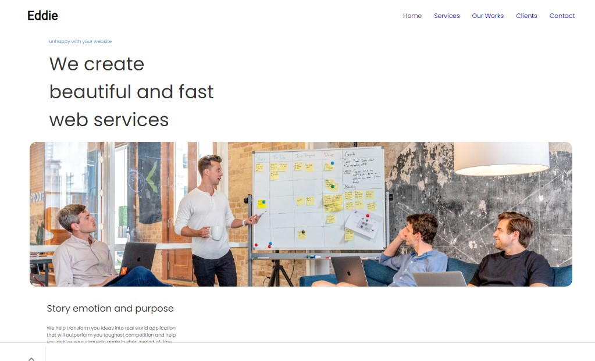

# Edie Homepage



This image is just a preview, the full design is on the figma file!

**Icon**: https://google.github.io/material-design-icons/

**Design** : https://www.figma.com/file/ahnGupP4JjTdVJDTRfMRF2

<!-- Please update value in the {}  -->

<h1 align="center">Eddie Home page</h1>

<div align="center">
  <h3>
    <a href="https://edie-homepage-tantely.netlify.app/">
      Demo
    </a>
    <span> | </span>
    <a href="https://github.com/starjardin/edie-homepage">
      Code
    </a>
  </h3>
</div>

<!-- TABLE OF CONTENTS -->

## Table of Contents

-   [Overview](#overview)
-   [Features](#features)
-   [How to use](#how-to-use)
-   [Contact](#contact)

<!-- OVERVIEW -->

## Overview


-   You can see the demo and the solution in these following links
  <a href="https://edie-homepage-tantely.netlify.app/">
    Demo
  </a> and
  <a href="https://github.com/starjardin/edie-homepage">
    Code
  </a>

-   It was a great opportunity to boost our knowledge on css grid and css flex-box which are very useful in css layouts.
-   I am certainly sure that my css tool belt has improved after accomplishing this project done. Css fonts were still a bit blury but now it becomes so much plainer.

## Features

<!-- List the features of your application or follow the template. Don't share the figma file here :) -->

## How To Use

<!-- Example: -->

To clone and run this application, you'll need [Git](https://git-scm.com) and [Node.js](https://nodejs.org/en/download/) (which comes with [npm](http://npmjs.com)) installed on your computer. From your command line:

```bash
# Clone this repository
$ git clone https://github.com/your-user-name/your-project-name

# Install dependencies
$ npm install

# Run the app
$ npm start
```

## Contact

-   GitHub [@your-username](https://github.com/starjardin)